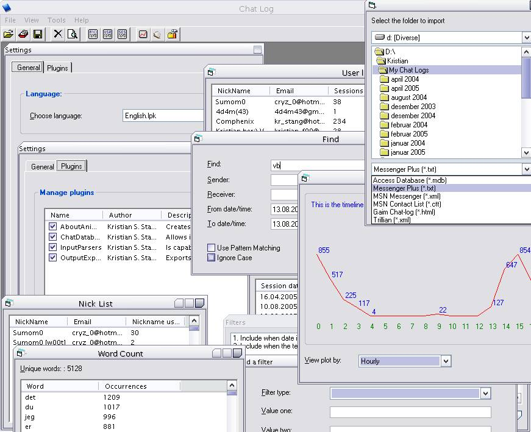



## ChatLogs

### Description

This is a pretty versatile chat log-parser that has the ability to read MSN, Messenger Plus, Gaim and Trillian chat logs, as well MSN Contact Lists. It can export to any one of these logs, as well to an Access-database.

With chat logs you have an overview of all the users appering anywhere in any chat log, all sessions and even all nicknames used by certain users. You can plot the instant message usage hourly, weekly and monthly, and you can retrive a list of all the used words in a range of sessions or by other conditions.

It is of course possible to search, either with just simple key words or with regular expressions. I've included two languages: English and Norwegian, but it could easliy be expanded.

All the input and output modules lies within external plugins - something that is made possible due to extensive use of COM-objects. It is therefore easy to expand the functionality of the application.

And, just for the sake of it, I've also implemented a 3D Star Wars-scroller.

It is important that you compile all plugins directly in the plugin-folder, not in any of the subfolders. Also remember that before you can compile this application, you MUST be sure that you have TABCTL32.OCX, vbaListView6.ocx and SSubTmr6.dll registered on your system. Preferably the files (and the bat-file within the OCX-folder) should be put in the System/System32-folder within the Windows-folder.

Here's the URLs of the files needed:

http://www.vbaccelerator.com/home/VB/Code/Libraries/Subclassing/SSubTimer/VB6_SSubTmr_Binary.asp

http://www.vbaccelerator.com/home/VB/Code/Controls/ListView/VB6_ListView_Control.asp

http://www.ascentive.com/support/new/support_dll.phtml?dllname=TABCTL32.OCX
 
### More Info
 
DLL-hell. Please register the correct versions of all the required files listed in the TXT-file (or above) inside the OCX-folder.

             |
---                |---
**Submitted On**   |2005-08-12 18:14:08
**By**             |[Kristian S\. Stangeland](https://github.com/Planet-Source-Code/PSCIndex/blob/master/ByAuthor/kristian-s-stangeland.md)
**Level**          |Advanced
**User Rating**    |4.3 (13 globes from 3 users)
**Compatibility**  |VB 5\.0, VB 6\.0
**Category**       |[Complete Applications](https://github.com/Planet-Source-Code/PSCIndex/blob/master/ByCategory/complete-applications__1-27.md)
**World**          |[Visual Basic](https://github.com/Planet-Source-Code/PSCIndex/blob/master/ByWorld/visual-basic.md)
**Archive File**   |[ChatLogs1923448122005\.zip](https://github.com/Planet-Source-Code/kristian-s-stangeland-chatlogs__1-62167/archive/master.zip)

